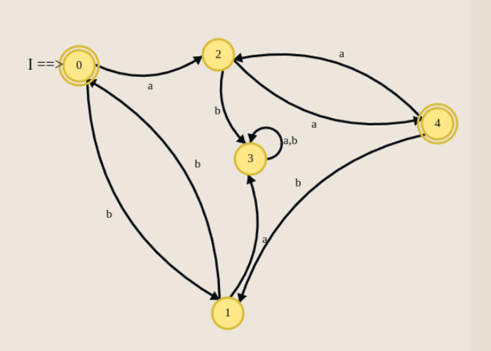
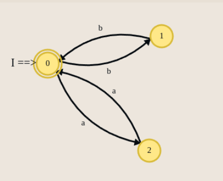

# Minimizare DFA

## Exemplu

Fie automatul AFD complet definit din desen. Se cere automatul minimal echivalent cu el.

**Pas 0:**
Orice stare nefinală este separabilă prin $\lambda$ de orice stare finală.
Deci împărțim stările din mulțimea $Q$ în cele două partiții inițiale, $A_0$ și $B_0$.
Apoi în interiorul tabelului cu tranziții, pentru fiecare stare destinație scriem din ce partiție de 
la pasul curent face parte.

| Partițiile | $\delta$ | $a$ | $b$ |
|------------|---|---|---|
| $A_0 = Q \setminus F$ | $q_1$ | $q_3 \in A_0$ | $q_0 \in B_0$ |
|            | $q_2$ | $q_4 \in B_0$ | $q_3 \in A_0$ |
|            | $q_3$ | $q_3 \in A_0$ | $q_3 \in A_0$ |
| $B_0 = F$  | $q_0$ | $q_2 \in A_0$ | $q_1 \in A_0$ |
|            | $q_4$ | $q_2 \in A_0$ | $q_1 \in A_0$ |

Obs: La fiecare pas $k$ o să redenumim partițiile $A_k$, $B_k$, $C_k$, etc.

**Pas k = 1:**
- Verificăm toate perechile de stări aflate în $A_0$:
  - $q_1$ și $q_2$ sunt separabile pentru că pe litera "a", $q_1$ ajunge în $A_0$ iar $q_2$ în $B_0$.
  - $q_1$ și $q_3$ rămân împreună (ambele ajung cu "a" în $A_0$ și cu "b" în stări din partiții diferite).
  - $q_2$ și $q_3$ sunt separabile pentru că pe litera "a", $q_2$ ajunge în $B_0$ iar $q_3$ în $A_0$.
- Verificăm stările din $B_0$:
  - $q_0$ și $q_4$ rămân împreună (ambele ajung în aceleași partiții pe fiecare literă).

Obținem partițiile:
| Partițiile | $\delta$ | $a$ | $b$ |
|------------|---|---|---|
| $A_1$ | $q_1$ | $q_3 \in C_1$ | $q_0 \in D_1$ |
| $B_1$ | $q_2$ | $q_4 \in D_1$ | $q_3 \in C_1$ |
| $C_1$ | $q_3$ | $q_3 \in C_1$ | $q_3 \in C_1$ |
| $D_1$ | $q_0$ | $q_2 \in B_1$ | $q_1 \in A_1$ |
|       | $q_4$ | $q_2 \in B_1$ | $q_1 \in A_1$ |

**Pas k = 2:**

Nu mai apar modificări față de pasul anterior, deci algoritmul se oprește.

Stările echivalente sunt: $q_0 \equiv q_4$.

Iar pe $q_3$ îl putem elimina deoarece este inaccesibil.

Automatul AFD minimal obținut va avea:
- $Q = \{q_1, q_2, q_{04}\}$ 
- $F = \{q_{04}\}$
- Starea inițială: $q_{04}$ (deoarece $q_0$ este stare inițială în automatul original)
- Tranzițiile se construiesc conform automatului inițial, ținând cont de gruparea stărilor:

## Exerciții

1. Considerați DFA-ul următor, precizați care sunt echivalențele din acest automat și dați automatul minimal echivalent.

2. Se dă următorul automat finit determinist complet definit:
Să se obțină un automat finit determinist minimal echivalent cu cel dat.

