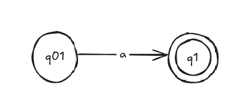

--- 
sidebar_position: 7 
---

# RegEx

## Transformarea RegEx → AFN-λ

### Caz i) RegEx = ∅ = λ = a, unde a ∈ Σ

$$
Limbaj ( L = \emptyset ) sau ( L = {\lambda} ) sau ( L = {a} )
$$

**Automat Finit:**

### Caz ii) (reuniune) $RegEx = e_1 + e_2$

$$
Limbaj ( L(e) = L(e_1) \cup L(e_2) )
$$

**Automat Finit:**

### Caz iii) (concatenare) $RegEx = e_1 \cdot e_2$

$$
Limbaj ( L(e) = L(e_1) \cdot L(e_2) )
$$

**Automat Finit:**

### Caz iv) (stelare) $RegEx = (e_1)^*$

$$
Limbaj \left( L(e) = (L(e_1))^* \right )
$$

**Automat Finit:**

## Transformarea AFN-λ → RegEx 

## Exerciții

1. Folosind algoritmul de la curs/seminar, transformați următorul automat finit într-o expresie regulată echivalentă (faceți și desenele și pentru pașii intermediari).
  

2. Se dă următoarea expresie regulată:

  $$
  (e_1 + e_2) \cdot (e_3)^*, \quad \text{unde}
  $$

  $$
  e_1 = a^* \cdot bb, \quad e_2 = c \cdot (dd)^* \cdot e, \quad e_3 = aa \cdot (b + ccc)
  $$

Să se obțină un automat finit care acceptă același limbaj ca cel descris de expresia dată.

3. Se dă următoarea expresie regulată:

$$
aba^*aba(ba)^*a
$$

Să se obțină un automat finit care acceptă același limbaj ca cel descris de expresia dată.

