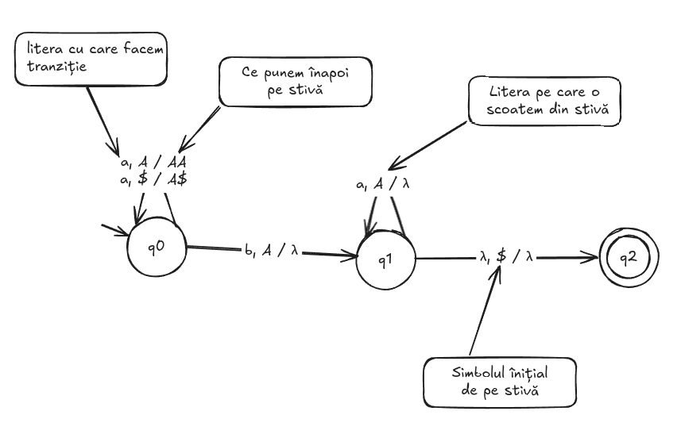

--- 
sidebar_position: 8 
---

# PDA

## Exemplu PDA $L = \set{a^n b^n | n \geq 0}$

Din PDA-uri TREBUIE intotdeauna să scoatem un simbol din stivă, chiar dacă nu mai avem nimic de citit.

Ex care merg: 

- λ, $ / λ

- b, B / λ

Ex care nu merg:

- λ, λ / λ

- a, λ / λ

- b, λ / B

## Exerciții

1. Să se construiască un PDA care acceptă limbajul:

$$
L = \left\{ a^n b^{2n} \mid n \geq 0 \right\}
$$

2. Să se construiască un PDA care acceptă limbajul:
$$
L = \left\{ 0^m 1^{n} 2^{m+n} \mid m, n \geq 0 \right\} 
$$

3. Să se construiască un PDA care acceptă limbajul:
$$
L = \left\{ 0^m 1^{m+3} 2^{n} \mid m, n \geq 2 \right\}
$$

4. Să se construiască un PDA care acceptă limbajul:
$$
L = \left\{ a^n b^k \mid 0 < n < k \right\}
$$

5. Să se construiască un PDA care acceptă limbajul:
$$
L = \left\{ w \cdot w^r \mid w \in \{ a, b \}^+ \right\}
$$

## Gramatici / Grammars

O **gramatică** este un sistem formal folosit pentru a genera cuvinte dintr-un anumit limbaj. O gramatică se notează $G = (N, T, S, P)$, unde:

- $N$ = mulțimea de **simboluri neterminale** (ex: $A, B, C, \ldots$), finită și nevidă.
- $T$ = mulțimea de **simboluri terminale** (ex: $a, b, c, \ldots$), finită.
- $S \in N$ = **simbolul de start**.
- $P$ = mulțimea de **producții** (sau reguli de producție).

Obs: $T$ este alfabetul peste care sunt definite cuvintele generate de gramatică.

### Gramatici regulate / Regular Grammars

O gramatică este **regulată** dacă toate regulile de producție sunt de una dintre formele:
- $A \rightarrow aB$
- $A \rightarrow a$
- $A \rightarrow \lambda$

unde $A, B \in N$, $a \in T$.

#### Echivalența dintre Gramaticile regulate și Automatele finite

| Gramatici regulate           | Automate finite                |
|-----------------------------|-------------------------------|
| $N$ = neterminale           | $Q$ = stări                   |
| $T$ = terminale             | $\Sigma$ = alfabet de intrare |
| $S \in N$ = start           | $q_0 \in Q$ = stare inițială  |
| $A \rightarrow aB$          | $\delta(q_A, a) = q_B$        |
| $A \rightarrow a$           | $\delta(q_A, a) = q_f$ (finală)|
| $A \rightarrow \lambda$     | $q_A$ este stare finală        |

#### Mod de funcționare a unei gramatici

1. Se pornește de la cuvântul format doar din simbolul de start $S$.
2. Cât timp este posibil, se aplică un pas de derivare:
   - Se alege un neterminal din cuvântul curent.
   - Se alege o producție cu acel neterminal în stânga.
   - Se înlocuiește o apariție a neterminalului cu partea dreaptă a producției.
3. Când cuvântul nu mai conține niciun neterminal, generarea s-a terminat, iar cuvântul obținut aparține limbajului generat de gramatică.

Gramaticile regulate sunt echivalente cu automate finite, adică pot genera exact limbajele regulate.

### Exemple de gramatici

1. $L = \{ a^n \mid n \geq 0 \}$
   - $S \rightarrow aS \mid \lambda$

2. $L = \{ a^{2n} \mid n \geq 0 \}$
   - $S \rightarrow aaS \mid \lambda$

3. $L = \{ a^n b^m \mid n, m \geq 0 \}$
   - $S \rightarrow aS \mid B$
   - $B \rightarrow bB \mid \lambda$

4. $L = \{ a^n b^m \mid n, m \geq 2 \}$
   - $S \rightarrow aS \mid B$
   - $B \rightarrow bB \mid bb$

## Exerciții

1. Să se construiască o gramatică care generează limbajul:

    $$
    L = \{ a^{2n} \mid n \geq 1 \}
    $$

2. Să se construiască o gramatică care generează limbajul:

    $$
    L = \{ a^{2n+1} \mid n \geq 0 \}
    $$

3. Să se construiască o gramatică care generează limbajul:

    $$
    L = \{ a^{2n} b^{3k} \mid n, k \geq 0 \}
    $$

4. Construiți o gramatică regulată echivalentă cu expresia regulată:

    $$
    E = ab a^* ab a (ba)^* a
    $$
