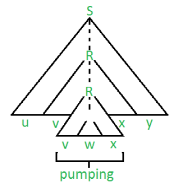

--- 
sidebar_position: 10
---

# Lema de pompare pentru limbaje independente de context

Fie $L$ un limbaj independent de context.  
Atunci $\exists p \in \mathbb{N}$ (număr natural) astfel încât pentru $ \forall \alpha \in L$ cu $|\alpha| \geq p$, există o descompunere $\alpha = u \cdot v \cdot w \cdot x \cdot y$ cu proprietățile:

1. $|v \cdot w \cdot x| \leq p$ (adică lungimea secvenței $vwx$ este mai mică sau egală cu $p$)

2. $|v \cdot y| \geq 1$ (adică lungimea secvenței $vy$ este mai mare sau egală cu 1)

3. $u \cdot v^i \cdot w \cdot x^i \cdot y \in L$ pentru orice $i \geq 0$ (adică putem repeta secvențele $v$ și $x$ de un număr arbitrar de ori, iar rezultatul va rămâne în limbajul $L$)

---

## Demonstrație pentru $L_1 = \{ a^n b^n c^n \mid n \geq 1 \} \notin \text{CFL}$

Presupunem prin reducere la absurd că $L_1$ este limbaj independent de context (CFL).  
Atunci $\exists p \in \mathbb{N}$ și putem aplica lema de pompare. (În continuare negăm afirmația lemei.)

Alegem cuvântul $w = a^p b^p c^p \in L_1$, cu $|w| = 3p \geq p$, $\forall p \in \mathbb{N}$.  
Conform lemei, cuvântul poate fi scris sub forma $w = u \cdot v \cdot w \cdot x \cdot y$ astfel încât $|v \cdot w \cdot x| \leq p$ și $|v \cdot y| \geq 1$, deci $1 \leq |v| + |y| \leq p$ (*).

Observăm că subșirul $vwx$ (de lungime maxim $p$) nu poate conține simultan litere de $a$, $b$ și $c$ (pentru că lungimea ar depăși cele $p$ litere de $b$).  
Prin urmare, $vwx$ poate conține doar 1 sau 2 tipuri de litere, deci există 5 cazuri:

**Caz I:** $vwx \in a^+ \Rightarrow vx = a^k$

Dar din (*) $\implies 1 \leq k \leq p$.

Fie $i = 2 \Rightarrow w' = u v^2 w x^2 y = a^{p+k} b^p c^p$

Știm că $w' \in L_1 \Leftrightarrow |w'|_a = |w'|_b \Leftrightarrow p+k = p \Leftrightarrow k = 0$
contradicție cu $1 \leq k$ (relația 1).

**Caz II:** $vwx \in b^+$  
**Caz III:** $vwx \in c^+$  
Se tratează analog cu Caz I $\Rightarrow$ contradicții (relațiile 2 și 3).

**Caz IV:** $vwx \in a^+ b^+$  
$\Rightarrow vx = a^k b^s$
Dar din (*) $\implies 1 \leq k + s \leq p$.

Fie $i = 0 \Rightarrow w' = u v^0 w x^0 y = u w y = a^{p-k} b^{p-s} c^p$

Știm că $w' \in L_1 \Leftrightarrow |w'|_a = |w'|_b = |w'|_c \Leftrightarrow p-k = p-s = p \Leftrightarrow k = s = 0$
contradicție cu $1 \leq k + s$ (relația 4).

$\Leftrightarrow |a| \neq |b|$ sau $|a| \neq |c|$, contradicție cu $1 \leq |v| + |x|$ (relația 4).

**Caz V:** $vwx \ b^+ c^+$  
Se tratează analog cu Caz IV $\Rightarrow$ contradicție (relația 5).

**Concluzie:**  
Din relațiile 1–5 (am obținut contradicții pentru toate cele 5 cazuri de descompunere) rezultă că presupunerea făcută este falsă $\Rightarrow L_1 \notin \text{CFL}$.

## Exerciții

1. Demonstrați că limbajul $L_1 = \{ a^n b^m c^n d^m \mid n, m \geq 0 \} \notin CFL$.

2. Demonstrați că limbajul $L_2 = \{ ww \mid w \in \{a, b\}^* \} \notin CFL$.

3. Spuneți dacă limbajul următor este independent de context sau nu; dacă da, construiți o gramatică independentă de context care să îl genereze, dacă nu, demonstrați folosind eventual lema de pompare că limbajul nu este independent de context.
   $L = \{ a^k w c w^r \mid w \in \{a, b, c\}^*,\ k \geq 4 \}$.

4. Spuneți dacă limbajul următor este independent de context sau nu; dacă da, construiți o gramatică independentă de context care să îl genereze, dacă nu, demonstrați folosind eventual lema de pompare că limbajul nu este independent de context.
   $L = \{ a^{2k} b^{3k} c^{5k} \mid k \geq 1 \}$.
   